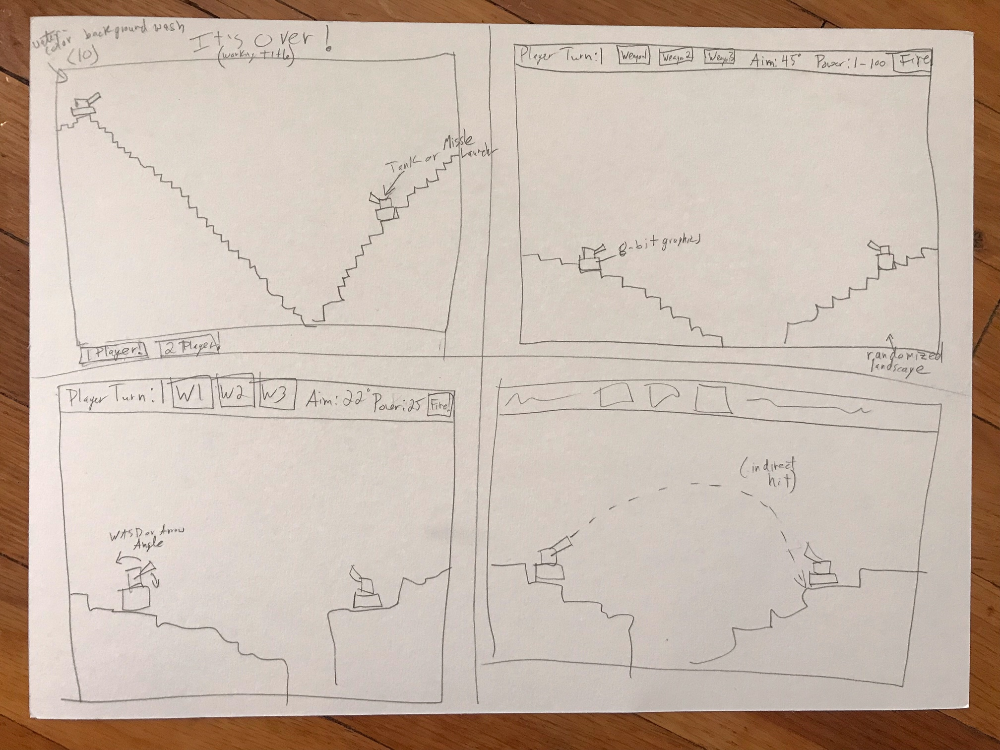
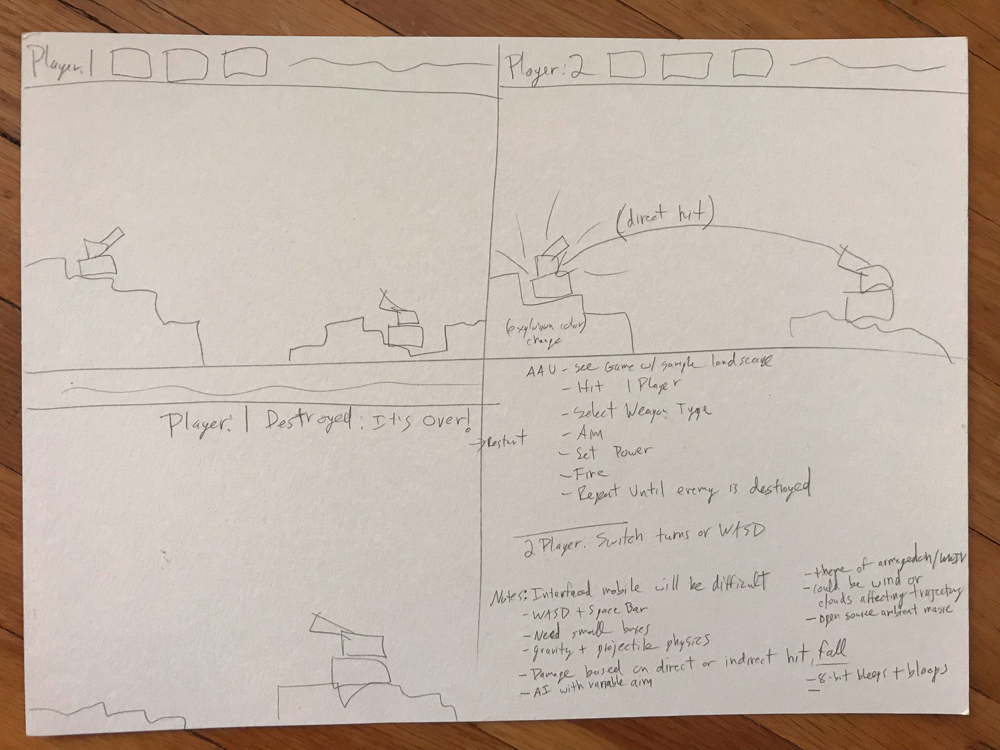

# ItsOver

Randy D'Abbraccio June 2022

Welcome to ItsOver, a game of bombs, backgrounds, and the dread of armageddon. This is a  simple game of destroying your enemy before they destroy you.

Instructions: You can play by yourself or with another person. 

To aim use:

A , D , Left Arrow, Right Arrow : adjusts angle of fire

W,  S , Up Arrow,   Down Arrow: adjusts power of fire

Select a weapon at the top. Then hit FIRE!

Destroy you enemy before they destroy you. IT'S OVER!

Functionality:
- Turn based
- Set aim and power
- Fire button to shooting
- 3 Weapons with different physics or explosion pattern
- 1 or 2 Player
- 1 Player vs Computer AI 
    - how to implement randomness / clumsiness
- Randomized terrain / set terrains
- Quasi-random unit placement
- Terrain destruction
- Fall damage
- Direct hit vs indirect hit
- use parabolic formulas
- use gravity formulas
- use canvas
- Bootstrap, however functionality could be hard. Maybe arrow visuals you click
    - maybe hard to get the screensize though
    - test the canvas / arena size on a mobile

Media:
- have some ambient or forboding music play. 3 different songs
- have 8-bit bleeps or lo-fi sounds for; shooting, explosion, gameover,
    weapon click, 

- 5 or so different watercolor-wash backgrounds as images

Layout:
- Player 1 / Player 2 buttons
- Up, Down, Left, Right buttons
- Fire buttons
- Weapon 1,2,3 buttons

Themes:
- Dark humor of end of world
- 8-bit simple graphics
- Digital vs waterclor aspects

Wants: 
- Additional weapon types
- Environmental factors: wind, 
- Other obstacles / trees or rocks...

Fun:
- Fun is in the dry humor
- Shooting element
- Differing Weapons
- Terrain removal
- Gravity physics
- Little small units

Potential Obstacles:
- Terrain destruction w/ gravity
- Weapon physics / trajectory physics
- Mobile vs physical keyboard

